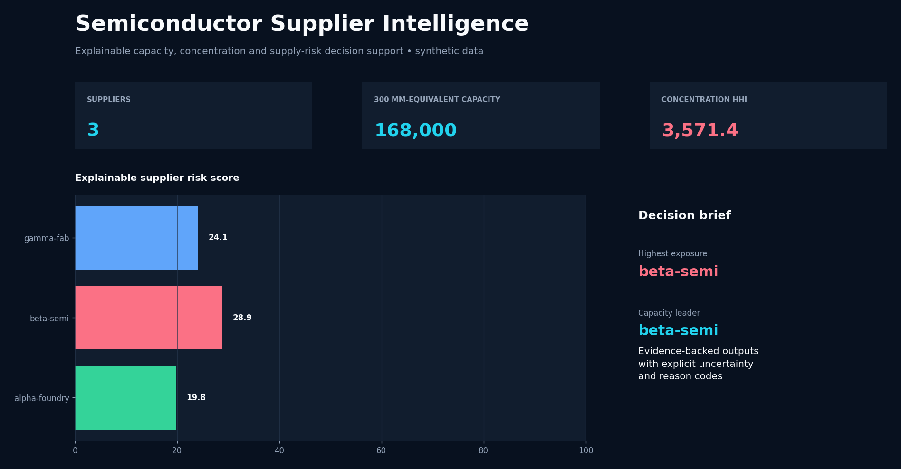
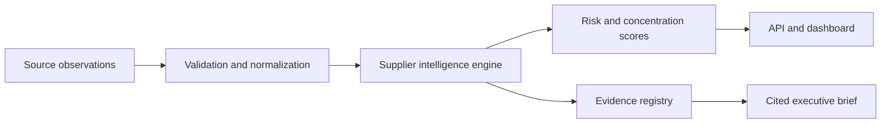

# Semiconductor Supplier Intelligence

[](https://github.com/Lonfea/semiconductor-supplier-intelligence/actions/workflows/ci.yml)


An auditable decision-support platform for semiconductor foundry market intelligence. It converts heterogeneous supplier observations into normalized capacity metrics, technology-node coverage, concentration indicators, explainable risk scores and management-ready briefs.

> Independent portfolio project using synthetic data. It is not affiliated with or endorsed by Infineon Technologies or any supplier.

## Dashboard preview



## Why it matters

External wafer manufacturing teams must combine incomplete technical, operational, geographic and commercial signals. This project demonstrates how a governed data product can make those signals comparable without hiding uncertainty.

## Capabilities

- Canonical supplier and fab records with strict validation
- Wafer-capacity normalization across 200 mm and 300 mm sites
- Technology-node coverage and supplier-concentration analytics
- Explainable multi-factor risk scoring with reason codes
- Data-quality scoring and explicit uncertainty penalties
- Cited executive briefs generated only from registered evidence
- FastAPI endpoints and Streamlit management dashboard
- Docker, automated tests, linting and GitHub Actions CI



## Quick start

```bash
python -m venv .venv
source .venv/bin/activate
pip install -e '.[dev]'
pytest
uvicorn supplier_intel.api:app --reload
```

In another terminal:

```bash
streamlit run src/supplier_intel/dashboard.py
```

API documentation is available at `http://localhost:8000/docs`.

## Example decision output

```json
{
  "supplier_id": "alpha-foundry",
  "risk_score": 46.8,
  "risk_band": "medium",
  "reason_codes": ["GEOGRAPHIC_CONCENTRATION", "SINGLE_SOURCE_NODE"],
  "data_quality": 0.92
}
```

## Engineering decisions

- Scores are deterministic and decomposable; every component is returned.
- Missing evidence increases uncertainty instead of silently becoming zero risk.
- Briefs can cite only evidence already present in the registry.
- Synthetic demo data keeps the repository reproducible and free of confidential information.

See [architecture and governance](docs/architecture.md) for assumptions and limitations.
